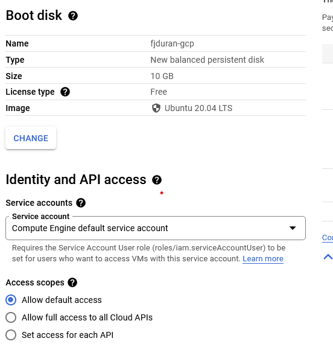
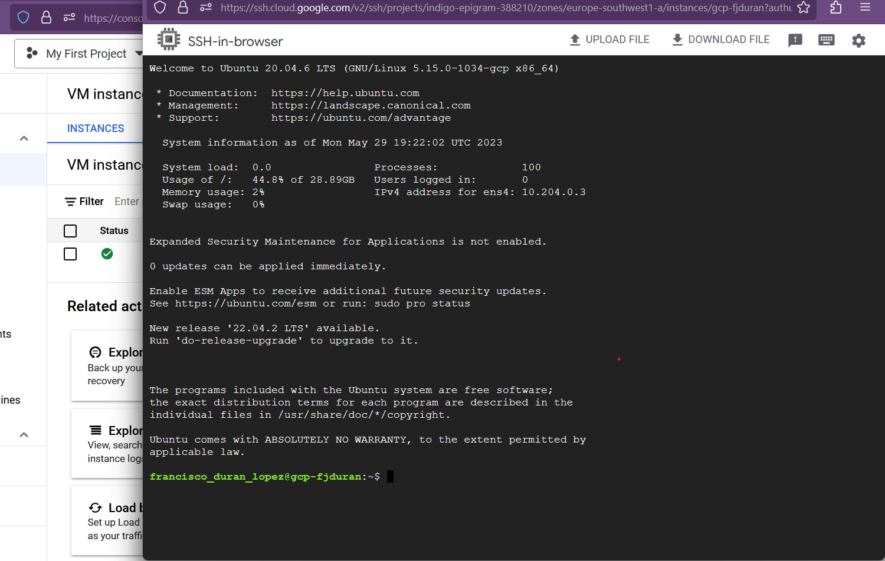
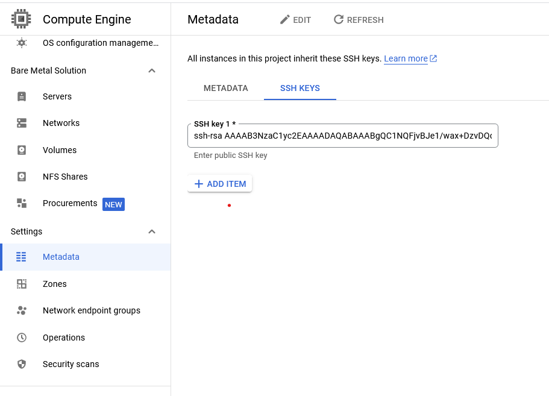

-------------------
# GCP setup: How to deploy ML models in a GCP VM?

1. Get a free GCP account:
   - https://cloud.google.com/?authuser=6&hl=es
2. Go to the [Google Cloud Console](https://console.cloud.google.com/).
3. **Pricing ----------------> IMPORTANT!**
   - Free tier resources offered by GCP: https://cloud.google.com/free
   - Before deploying your machine learning models on GCP, it's crucial to have a clear understanding of GCP pricing. GCP operates on a pay-as-you-go pricing model, where you pay for the resources and services you use beyond the free tier limits. It's crucial to have a clear understanding of GCP's pricing to manage your costs effectively. You can review GCP's pricing details on [the Google Cloud Pricing](https://cloud.google.com/pricing) page.
   - Setting up a budget:
      - https://cloud.google.com/billing/docs/how-to/budgets
   - Caution for users:
     - While Budgets are a powerful tool for managing costs, it's essential to emphasize the importance of cost-consciousness
       - Cost: Verify the costs of using your resources: https://cloud.google.com/pricing
       - Cleanup: Clean up  resources that are no longer needed. 
       - Alerts: Set up alerts to be sent to your email in case you exceed any budget.
4. Create a new project (See 'My First Project').

<center><figure>
  </center>
<p style="text-align: center;">Welcome screen.</p>

5. In the left navigation menu, click on "Compute Engine" under the "Compute" section and select "VM instances".

<center><figure>
  </center>
<p style="text-align: center;">VM instances.</p>

6. Click on the "Create instance" button to create a new virtual machine instance.

<center><figure>
  </center>
<p style="text-align: center;">Create VM instance.</p>

7. Select the desired configuration for the virtual machine, such as machine type, CPU, memory, and storage options. 
Allow https traffic.
- In this case we use: N2 series, 8GB RAM and 30 GB of storage.
- Region: europe-southwest


<center><figure>
  </center>
<p style="text-align: center;">Configure instance.</p>

8. Select an Ubuntu image and 30 GB of storage.

<center><figure>
  </center>
<p style="text-align: center;">OS image configuration.</p>

9. Configure the additional settings as per your requirements, including the region, network settings, and SSH access.

10. Review the configuration and click on the "Create" button to create your virtual machine. Note the monthly estimate 
is \$68 and we have \$300 credit, in that case we will not exceed the free resources. However, you can also set a Budget
for your project, and set alarms (See https://cloud.google.com/billing/docs/how-to/budgets).

<center><figure>
  </center>
<p style="text-align: center;">Pricing.</p>


11.  Wait for the virtual machine to be provisioned. Once it is ready, you can find its details on the Compute Engine 
dashboard, including its public IP.

<center><figure>
  </center>
<p style="text-align: center;">Get public IP.</p>

12.   To connect to the virtual machine via SSH, click on the SSH button next to the virtual machine instance name.
This will open a terminal window directly in your browser.
    
<center><figure>
  </center>
<p style="text-align: center;">SSH-in-browser</p>

13.  You are now connected to your GCP free tier virtual machine and can start using it for your desired tasks.

14. To connect to the VM via SSH from your local machine:
    1.  Generate your SSH keys 
    ```shell
        ssh-keygen -t rsa -f ~/.ssh/gcp-vm
    ```
    2.  Go to metadata and add your public ssh key
    3. Connect to the VM using your private key
    ```shell
        ssh -i ~/.ssh/gcp-vm fjdur@X.X.X.X
    ```

<center><figure>
  </center>
<p style="text-align: center;">Adding SSH keys.</p>

15.  Clone repository. See [Step 4](01_deploy_general.md)
16.  Set Up the Environment. See [Step 5](01_deploy_general.md)
17.  Run the API. See [Step 6](01_deploy_general.md)
18.  Access the API. See [Step 7](01_deploy_general.md)