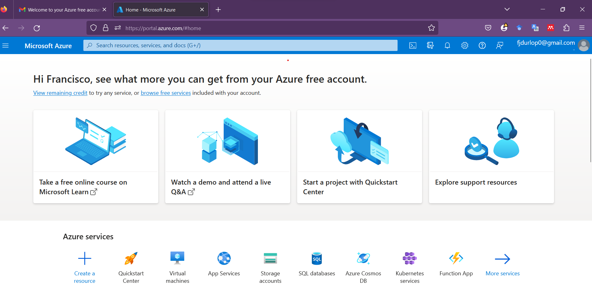
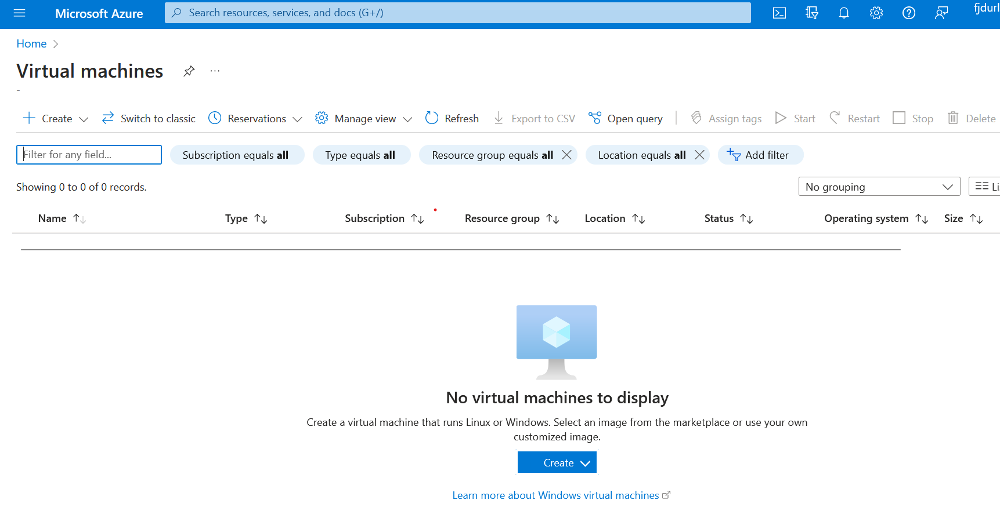
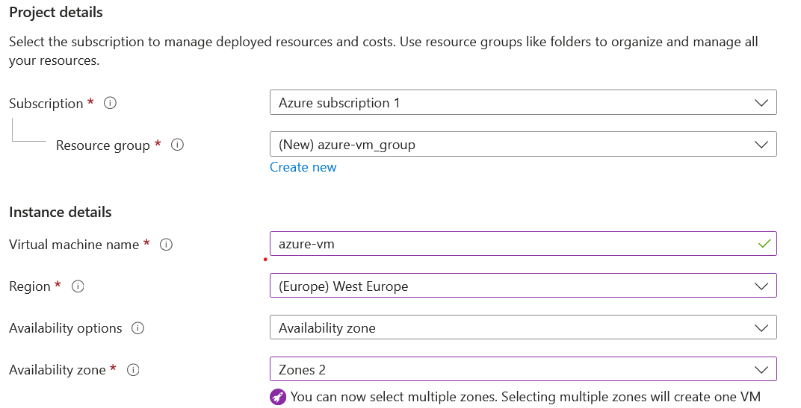
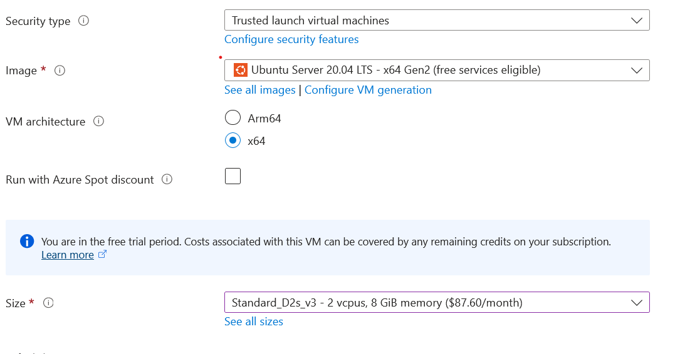
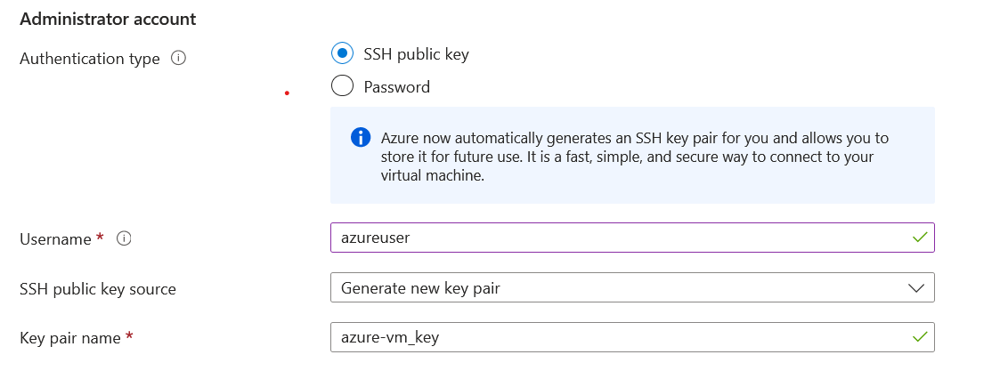
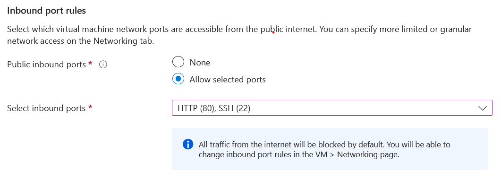
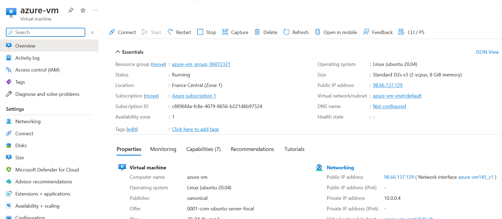

-------------------
# AWS setup: How to deploy ML models in a AWS VM?


1. **Get a  [free Azure account](https://azure.microsoft.com/en-us/free/):**
  - You have $200 free credit and expires in 29 days

2. **Sign in to Azure Portal.** 
  - Go to the Azure portal (https://portal.azure.com/) and sign in with your Azure account credentials. Sign up if you
    do not have an account.

<center><figure>
  </center>
<p style="text-align: center;">Azure portal.</p>

3. **Pricing ----------------> IMPORTANT!**
   - Free tier resources offered by Azure: https://azure.microsoft.com/free/
   - Before deploying your machine learning models on Azure, it's crucial to have a clear understanding of Azure pricing. Azure follows a pay-as-you-go pricing model, where you are billed based on your actual usage. Awareness of potential costs is essential when running ML workloads on Azure.
   - Setting up a budget:
      - https://learn.microsoft.com/en-us/azure/cost-management-billing/costs/tutorial-acm-create-budgets
   - Caution for users:
     - While Budgets are a powerful tool for managing costs, it's essential to emphasize the importance of cost-consciousness
       - Cost: Verify the costs of using your resources: https://azure.microsoft.com/pricing/
       - Cleanup: Clean up  resources that are no longer needed. 
       - Alerts: Set up alerts to be sent to your email in case you exceed any budget.

5. **Navigate to Virtual Machines and Create a new VM.** 

<center><figure>
  </center>
<p style="text-align: center;">Azure Vrtual Machines.</p>

6. **Configurate your VM.** 
   - Configure the instance details. Allow SSH traffic and HTTPS traffic from the internet.
   - Create and review
   - When the Generate new key pair window opens, select Download private key and create resource. Your key file will be
    download as azurevmkey.pem. Make sure you know where the .pem file was downloaded; you will need the path to it in
    the next step.

<center><figure>
  </center>
<p style="text-align: center;">Azure VM details.</p>

<center><figure>
  </center>
<p style="text-align: center;">Azure VM details.</p>

<center><figure>
  </center>
<p style="text-align: center;">Azure VM details.</p>

<center><figure>
  </center>
<p style="text-align: center;">Azure VM details.</p>

7.  **Wait for the virtual machine to be provisioned.**
    - Once it is ready, you can find its details on your VM dashboard, including its public IP.

<center><figure>
  </center>
<p style="text-align: center;">Azure VM details.</p>

8.   **Access your Instance via SSH.** 
     - Once the instances are launched, you can connect to them using SSH. Open your terminal or SSH client and use the
      downloaded private key file to establish an SSH connection to your instance. The command typically looks like this:
     ```shell
     ssh -i /path/to/private_key.pem username@public_ip
     ```

     - Replace /path/to/private_key.pem with the actual path to your private key file, username with the appropriate
      username, and public_ip with the public DNS name or IP address of your instance.
     - See also [Step 3](01_deploy_general.md)

9.  **Clone repository. See [01_deploy_general.md: Step 4](01_deploy_general.md)**
10.  **Set Up the Environment. See [01_deploy_general.md: Step 5](01_deploy_general.md)**
11.  **Run the API. See [01_deploy_general.md: Step 6](01_deploy_general.md)**
12. **Access the API. See [01_deploy_general.md: Step 7](01_deploy_general.md)**  


