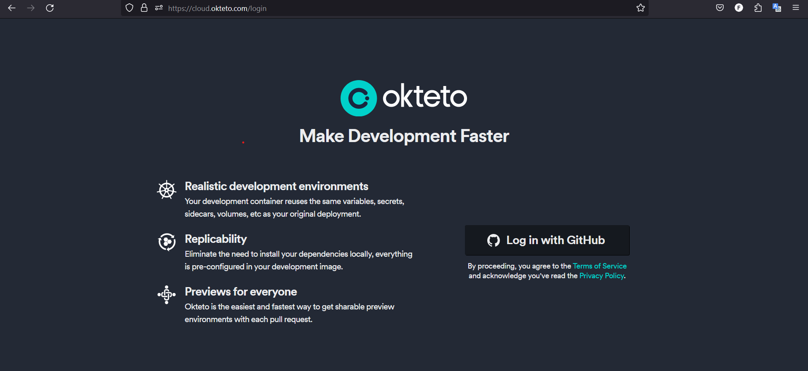
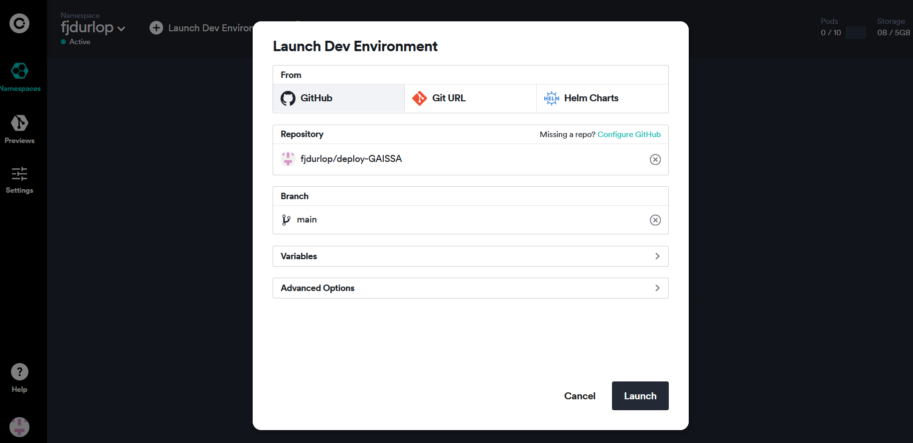
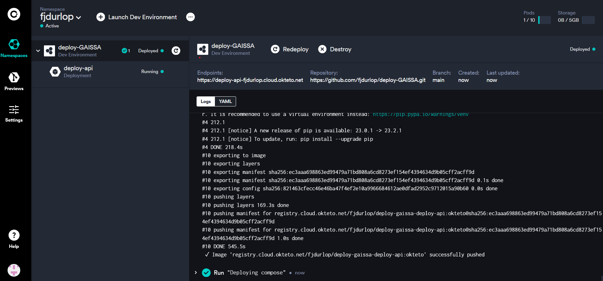
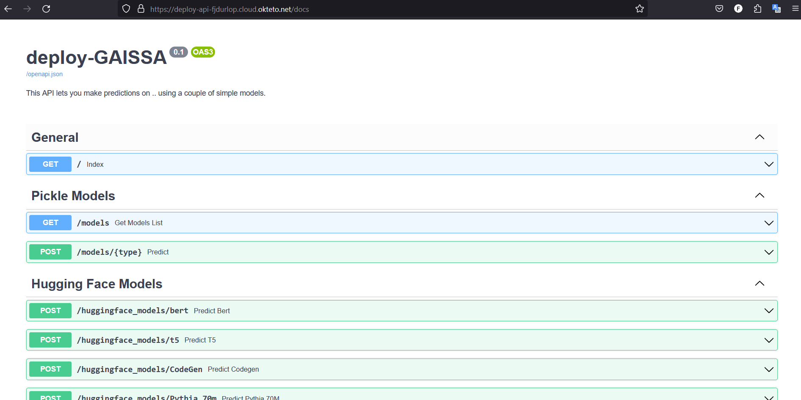

# Okteto setup: How to deploy ML models in Okteto?
- Web: https://cloud.okteto.com/
- How to deploy ML models with FastAPI + uvicorn using Okteto platform

## What is okteto?
Okteto is a platform that simplifies the process of launching cloud development environments without requiring the expertise to do this yourself. 
Okteto's Development Environments enable you to automatically deploy your application to a cloud development environment and see all of your code changes the moment you hit 'save' locally on your machine.

- deploy quickly
- easy management
- easy development

## Deployment
1. Add an organization email to your github account
2. Install okteto CLI
   - https://www.okteto.com/docs/cloud/okteto-cli/
3. Configuring Okteto CLI with Okteto
   - ```okteto context use https://cloud.okteto.com```
4. You can confirm that your CLI is configured by running the command below
   - ```okteto context list```
5. Define okteto manifest (okteto-stack.yaml) in the main directory
   - okteto-stack.yaml: is a manifest format for describing development environments.
   - In the okteto-stack.yaml file, define the application using a format that's very similar to docker-compose:
   ```
      name: deploy-gaissa
      services:
         deploy-api:
            public: true
            image: fjdurlop/deploy-gaissa:latest
            build: .
            replicas: 1
            ports:
               - 8080
            resources:
               cpu: 1000m
               memory: 3Gi
   ```
6. Create main.py in the main directory
   ```
   import uvicorn
   if __name__ == "__main__":
      uvicorn.run("app.api:app", host="0.0.0.0", port=8080, reload=True)
   ```
7. Create Dockerfile in the main directory
   ```
   FROM python:3.8
   ADD requirements.txt /requirements.txt
   ADD main.py /main.py
   ADD okteto-stack.yaml /okteto-stack.yaml
   RUN pip install -r requirements.txt
   EXPOSE 8080
   COPY ./app app
   CMD ["python3", "main.py"]
   ```
<center><figure>
  </center>
<p style="text-align: center;">Welcome screen.</p>

8. Run application:
   - ```okteto stack deploy --build```
      - Deploys the service indicated in the okteto-stack.yml
   - GUI
      - Launch Dev Environment
      - Add your github repository, which already has the Dockerfile and okteto manifest
      - Launch

<center><figure>
  </center>
<p style="text-align: center;">Launch environment using Github repository.</p>

<center><figure>
  </center>
<p style="text-align: center;">Service running.</p>

9. After running go to your dev environment (In your dashboard) that is already deployed and there you can see the available endpoints to make inferences with the models that are in your app
    - Open a web browser with the endpoint(https://deploy-api-fjdurlop.cloud.okteto.net in this case) or use a tool like cURL or Postman to make HTTP requests to the API endpoints.
    - Send requests to the API with the required input data and parameters to obtain predictions.

<center><figure>
  </center>
<p style="text-align: center;">API.</p>

Examples
- https://python.plainenglish.io/deploy-pytorch-model-with-okteto-cli-d494d058216
- https://www.okteto.com/docs/samples/python/
- https://www.okteto.com/blog/building-and-deploying-a-fastapi-app-in-okteto-cloud/