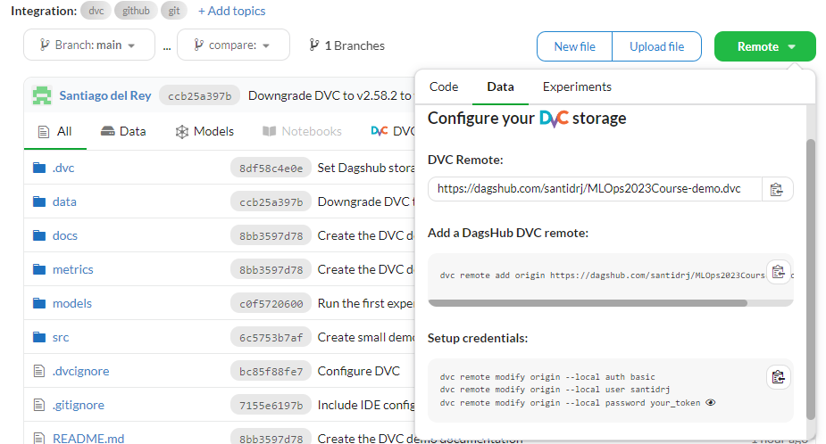

# DVC demo for the MLOps 2023-24 course
In this demo we will see the main features of [DVC](https://dvc.org/) to version control the data and the models of a 
simple machine learning project.

The scrips used in this project are based on the [SE4AI2021Course_DVC-demo](https://github.com/se4ai2122-cs-uniba/SE4AI2021Course_DVC-demo)
project. Hence, the examples uses data from the [Housing Prices Competition for Kaggle Learn Users](https://www.kaggle.com/c/home-data-for-ml-course).

## Install DVC
First, we need to install DVC. We can do this by running the following command:

### Using poetry
```bash
poetry add dvc@<3.0
```

### Using pdm
```bash
pdm add dvc<3.0
```

### Using pipenv
```bash
pipenv install "dvc<3.0"
```

### Using pip
```bash
pip install "dvc<3.0"
```

> **Note:** DagsHub does not support DVC 3.0 and its new hashing mechanism. Please use DVC 2.x for now.

## Initialize DVC
To initialize DVC in our project. We can do this by running the [`dvc init`](https://dvc.org/doc/command-reference/init) command:

```bash
dvc init
```

This will create a `.dvc` directory in our project, and a `.dvcignore` file to specify files that we do not want to track.

## Configure DVC
Next, we will configure DVC to use a remote storage to store the data and the models. We will use Dagshub Storage as a
remote since it has 100GB of free storage and has a good integration with DVC. To do this, we first need to create a
repository in Dagshub or to link our GitHub repository to Dagshub. Then, we can easily configure DVC to use Dagshub
Storage as its remote by following the instructions in your Dagshub repository.

<p align="center">
    
</p>

## Working with DVC
### Import raw data
As a first step, we will import the raw data using the [`dvc import`](https://dvc.org/doc/command-reference/import) command:

```bash
dvc import https://github.com/collab-uniba/Software-Solutions-for-Reproducible-ML-Experiments input/home-data-for-ml-course/train.csv -o data/raw

dvc import https://github.com/collab-uniba/Software-Solutions-for-Reproducible-ML-Experiments input/home-data-for-ml-course/test.csv -o data/raw
```

Observe that, although available in Kaggle, we import the data from another public GitHub repository,
[Software Solution For Reproducible ML Experiments](https://github.com/collab-uniba/Software-Solutions-for-Reproducible-ML-Experiments).
This is to demonstrate the capability of DVC to download a file or directory tracked by another DVC or Git repository,
and track it. This means that, if the data changes in the original repository, we can update it in our
project by running [`dvc update`](https://dvc.org/doc/command-reference/update).

Alternatively, we could also use the [`dvc get`](https://dvc.org/doc/command-reference/get) command to download the data.
Unlike `dvc import`, `dvc get` does not track the data, but it is useful to download data from a remote storage without
tracking it. If we wanted to track them after downloading them, we could use [`dvc add`](https://dvc.org/doc/command-reference/add)
to add them to the DVC repository. However, we would not get the benefits of tracking the data in the original repository.

```bash
dvc get https://github.com/collab-uniba/Software-Solutions-for-Reproducible-ML-Experiments input/home-data-for-ml-course/train.csv -o data/raw

dvc get https://github.com/collab-uniba/Software-Solutions-for-Reproducible-ML-Experiments input/home-data-for-ml-course/test.csv -o data/raw
```

### Create a DVC pipeline
Now, we will create a DVC pipeline to prepare the data, and train the model. This pipeline will consist of three stages:
`prepare`, `train`, and `evaluate`. The `prepare` stage will clean the data, and split it into training and validation
sets. The `train` stage will train a regression model using the training set. Finally, the `evaluate` stage will evaluate
the model using the validation set.

To create a stage we use the [`dvc stage add`](https://dvc.org/doc/command-reference/stage/add) command.

#### Data preparation stage
```bash
dvc stage add -n prepare \
-p prepare.train_size,prepare.test_size,prepare.random_state \
-d src/prepare.py -d data/raw/train.csv -d data/raw/test.csv \
-o data/processed/X_train.csv -o data/processed/X_valid.csv \
-o data/processed/y_train.csv -o data/processed/y_valid.csv \
python -m src.prepare
```

The options used in the command are the following:
* `-n`: name of the stage
* `-p`: parameters of the stage. Any stage can depend on parameter values from a parameters file
([params.yaml](../params.yaml) by default).
* `-d`: dependencies of the stage. Any stage can depend on data files, code files, or other stages. Notice that the
source code itself is marked as a dependency as well. If any of these files change, DVC will know that this stage needs
to be reproduced when the pipeline is executed.
* `-o`: specify a file or directory that is the result of running the command.
* The last line, `python -m src.prepare` is the command to run in this stage 

> **Note:** DVC uses the pipeline definition to automatically track the data used and produced by any stage, so there's no
need to manually run `dvc add` for data/prepared!

#### Model training stage
```bash
dvc stage add -n train \
-p train.random_state,train.algorithm \
-d src/train.py -d data/processed/X_train.csv -d data/processed/y_train.csv \
-o models/iowa_model.pkl \
python -m src.train
```

#### Model evaluation stage
```bash
dvc stage add -n evaluate \
-d models/iowa_model.pkl -d src/evaluate.py -d data/processed/X_valid.csv -d data/processed/y_valid.csv \
-M metrics/scores.json \
python -m src.evaluate
```

In this stage, we use the `-M` option to specify that the stage produces a metrics file that will not be cached by DVC.

### Run the pipeline
The details about each stage are automatically stored by DVC in the [`dvc.yaml`](../dvc.yaml) file. We can run the pipeline by executing
the following command:

```bash
dvc repro
```

You'll notice a [`dvc.lock`](../dvc.lock) (a "state file") was created to capture the reproduction's results. It is a
good practice to commit this file to Git after its creation or modification, to record the current state and results.
