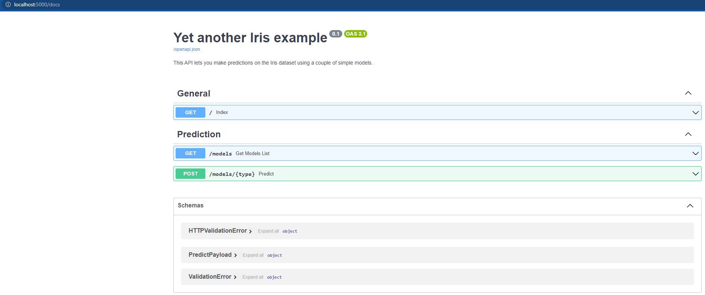

# FastAPI demo for the MLOps 2023-24 course <!-- omit in toc -->
In this demo we will see the main features of [FastAPI](https://fastapi.tiangolo.com/) to create an API for a simple
machine learning project.

The scrips used in this demo are based on the [SE4AI2021Course_FastAPI-demo](https://github.com/se4ai2122-cs-uniba/SE4AI2021Course_FastAPI-demo) GitHub project.

## Contents <!-- omit in toc -->
- [Install FastAPI](#install-fastapi)
- [Creating a simple API](#creating-a-simple-api)
- [Start the server](#start-the-server)
- [Try the API](#try-the-api)
  - [Access the API documentation](#access-the-api-documentation)
  - [Try some requests](#try-some-requests)
- [Test the API](#test-the-api)


## Install FastAPI
The first step is to install FastAPI and Uvicorn, which is a fast ASGI server (it can run asynchronous code in a single
process) to launch our application. Additionally, we will install [httpx](https://www.python-httpx.org/) which we will
use to test our API. To do this, we can run the following command:

### Using poetry <!-- omit in toc -->
```bash
poetry add fastapi "uvicorn[standard]"
poetry add -G dev httpx
```

### Using pdm <!-- omit in toc -->
```bash
pdm add fastapi "uvicorn[standard]"
pdm add -dG test httpx
```

### Using pipenv <!-- omit in toc -->

```bash
pipenv install fastapi "uvicorn[standard]" httpx
```

### Using pip <!-- omit in toc -->
```bash
pip install fastapi "uvicorn[standard]" httpx
```


## Creating a simple API
We can now create a simple API. To do this, we create a new file called [`api.py`](../src/app/api.py) in the `src/app`
directory. In this file, we will create a FastAPI application and three endpoints:
- `/` will be the root endpoint, which will return a welcome message;
- `/models` will return a list of the available models and their metrics. Optionally, we can use the query parameter
  `type` to filter the models.
- `/models/{type}` will return the prediction of the model specified in the path parameter.

Since the `/models/{type}` endpoint receives a payload specifying the features of the flower, we will create a Pydantic
class called `PredictPayload` to represent our payload. This class will be located in the
[`schemas.py`](../src/app/schemas.py) file.


In addition, we create two extra functions:
- `construct_response` will be used as a wrapper to return the response in a standard format;
- `_load_models` will be used to load the models from the `models/` directory on startup.


## Start the server
Use the following command to start the server:

```bash
uvicorn src.app.api:app \
    --host 0.0.0.0 \
    --port 5000 \
    --reload \
    --reload-dir src/app \
    --reload-dir models
```
In detail:

- `uvicorn src.app.api:app` is the location of app (`src` directory > `app` directory > `api.py` script > `app` object);
- `--reload` makes the server reload every time we update;
- `--reload-dir app` makes it only reload on updates to the `app/` directory;
- `--reload-dir models` makes it also reload on updates to the `models/` directory;

## Try the API
We can now test that the application is working. These are some of the possibilities:

- Visit [localhost:5000](http://localhost:5000/)
- Use `curl`

  ```bash
  curl -X GET http://localhost:5000/
  ```

- Access the API programmatically, e.g.:

  ```python
  import json
  import requests

  response = requests.get("http://localhost:5000/")
  print(json.loads(response.text))
  ```

- Use an external tool like [Postman](https://www.postman.com), which lets you execute and manage tests that can be 
saved and shared with others.

### Access the API documentation
You can access the [Swagger UI](https://swagger.io/tools/swagger-ui/) in http://localhost:5000/docs for documentation
endpoint and select one of the models. The documentation generated via [Redoc](https://github.com/Redocly/redoc) is
accessible at the `/redoc` endpoint.


<center><figure>
  </center>
<p style="text-align: center;">API User Interface in localhost:5000/docs endpoint.</p>

### Try some requests
To try an API request, click on the "Try it out" button and click execute.

For example:
#### Virginica (2) <!-- omit in toc -->

```json
{
  "sepal_length": 6.4,
  "sepal_width": 2.8,
  "petal_length": 5.6,
  "petal_width": 2.1
}
```

#### Setosa (0) <!-- omit in toc -->

```json
{
  "sepal_length": 5.7,
  "sepal_width": 3.8,
  "petal_length": 1.7,
  "petal_width": 0.3
}
```

## Test the API
We can now test the API using [Pytest](https://docs.pytest.org/en/6.2.x/). To do this, we create a new file called [`test_api.py`](../src/tests/test_api.py) in the `tests/` directory.

Here we will create a fixture called `client` that will be used to test the API. We will also create a second fixture called `payload` that will be used to test the `/models/{type}` endpoint.

Finally, we will create a test for each endpoint. To do this, we will use the `client` fixture to make requests to the API and check the response.