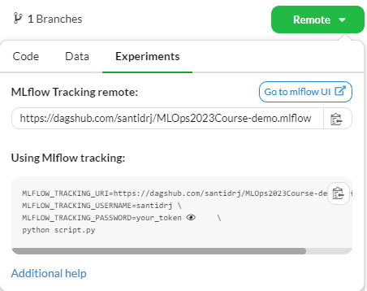
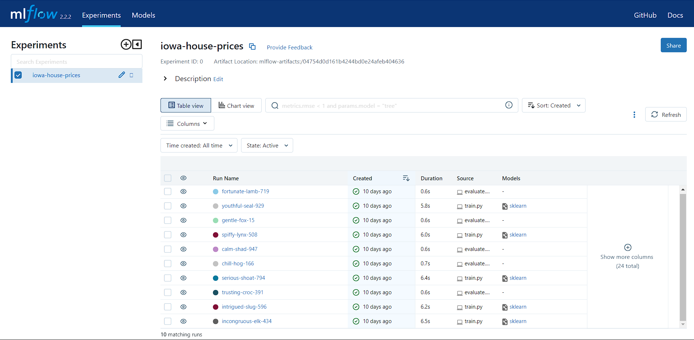

# MLflow demo for the MLOps 2023-24 course <!-- omit in toc -->
In this demo we will see the main features of [MLflow](https://mlflow.org/) to track the experiments of a simple machine
learning project.

## Contents <!-- omit in toc -->
- [Install MLflow](#install-mlflow)
- [Configure a tracking server](#configure-a-tracking-server)
- [MLflow experiments](#mlflow-experiments)
- [Add MLflow tracking to the code](#add-mlflow-tracking-to-the-code)
- [MLflow UI](#mlflow-ui)
- [DVC pipelines + MLflow](#dvc-pipelines--mlflow)


## Install MLflow
First, we need to install MLflow. We can do this by running the following command:

### Using poetry <!-- omit in toc -->
```bash
poetry add mlflow
```

### Using pdm <!-- omit in toc -->
```bash
pdm add mlflow
```

### Using pipenv <!-- omit in toc -->

```bash
pipenv install mlflow
```

### Using pip <!-- omit in toc -->
```bash
pip install mlflow
```

## Configure a tracking server
By default MLflow stores the tracking data locally in an `mlruns` subdirectory of where you ran the code. However, we
can configure MLflow to use a shared storage in a remote server.

In this demo we will use Dagshub  as it provides an easy
way to configure a tracking server. To do this, we first need to create a repository in Dagshub or to link our GitHub
repository to Dagshub. Then, we can easily configure MLflow to use Dagshub as its tracking server by setting the
environment valiables shown in the Dagshub repository.

<p align="center">
    
</p>

To add the environment variables to our project we can use a `.env` file the following content:

```bash
MLFLOW_TRACKING_URI=https://dagshub.com/<DagsHub-user-name>/<reposytory-name>.mlflow
MLFLOW_TRACKING_USERNAME=your_username
MLFLOW_TRACKING_PASSWORD=your_token
```

Then, we can load the environment variables adding the following code to our `__init__.py` file:

```python
from dotenv import load_dotenv

load_dotenv()
```

**Remember to include the `.env` file in the `.gitignore` file to avoid committing your credentials to the repository.**

## MLflow experiments
MLflow organizes executions into experiments, runs, and artifacts. An experiment is a set of runs that share the same
code context. A run is an execution of a data science workflow. An artifact is a file or directory generated by a run.

For example, we can create an experiment for each model we want to train. Then, we can create a run for each training of
that model. Finally, we can log the metrics and artifacts of each run.
See the [MLflow documentation](https://mlflow.org/docs/latest/concepts.html#experiments) for more details.

By default, MLflow logs data into the `Default` experiment. To specify an experiment we can use the
[`mlflow.set_experiment()`](https://mlflow.org/docs/latest/python_api/mlflow.html#mlflow.set_experiment) function.
For example, we can add the following code to our `train.py` file:

```python
import mlflow

mlflow.set_experiment("iowa-house-prices")
```

## Add MLflow tracking to the code
MLflow comes with automatic logging APIs for several machine learning frameworks. In these cases, we can use the
[`mlflow.<framework>.autolog()`](https://mlflow.org/docs/latest/tracking.html#automatic-logging) function to automatically
log the parameters, metrics, and model artifacts from our machine learning code.
For an example see the [`train.py`](../src/train.py) file.

> **Note:** Autologging is only supported for certain versions of the frameworks. If you are using the latest version of
some of these frameworks you might get some errors.
See the [MLflow documentation](https://mlflow.org/docs/latest/tracking.html#automatic-logging) for more details.

If you are using a framework that is not supported by MLflow or want to log custom parameters, metrics or artifacts, you
can use the [`mlflow.log_param()`](https://mlflow.org/docs/latest/python_api/mlflow.html#mlflow.log_param),
[`mlflow.log_metric()`](https://mlflow.org/docs/latest/python_api/mlflow.html#mlflow.log_metric) and
[`mlflow.log_artifact()`](https://mlflow.org/docs/latest/python_api/mlflow.html#mlflow.log_artifact) functions. See the
[`evaluate.py`](../src/evaluate.py) file for an example.
See the [MLflow documentation](https://mlflow.org/docs/latest/tracking.html#logging-data-to-runs) for more details.

## MLflow UI
MLflow provides a UI to visualize the experiments, runs and artifacts. When using Dagshub as a tracking server, we can
get the MLflow UI URL by clicking on the remote icon and opening the experiments tab.

<p align="center">
    
</p>

## DVC pipelines + MLflow
You need to keep in mind that MLflow interprets each pipeline step as a run. Therefore, if you are using DVC pipelines
with MLflow you will have the metrics, parameters and artifacts of each step in separate runs. However, there are some
workarounds to this problem. See [this](https://www.sicara.fr/blog-technique/dvc-pipeline-runs-mlflow) post about how to
integrate DVC pipelines and MLflow.
